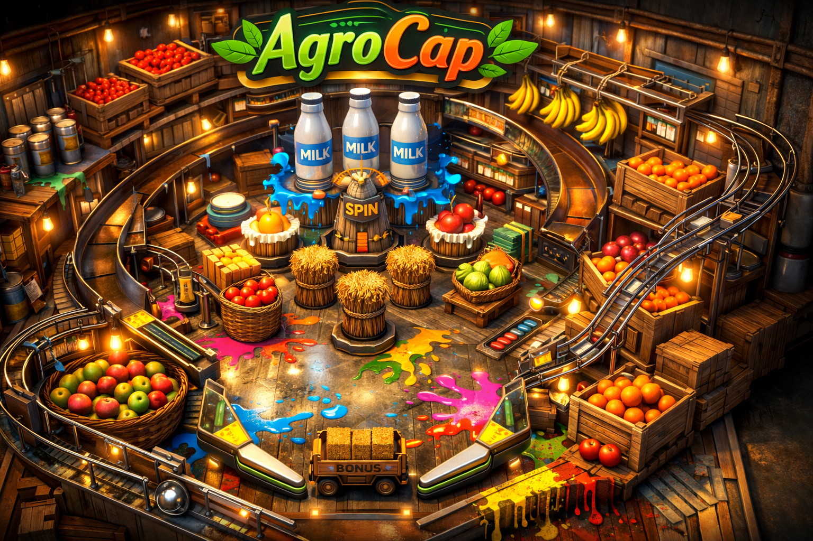

```sh
Utilize o site <https://www.toptal.com/developers/gitignore> para gerar seu arquivo gitignore e apague este campo.

Vide tutoriais do PI.
```

# FECAP - Fundação de Comércio Álvares Penteado

<p align="center">
<a href= "https://www.fecap.br/"></a>
</p>

# Nome do Projeto AgroCAP

## Nome do Grupo AgroCapinhos

## Integrantes: <a href="https://www.linkedin.com/in/kauã-casella-da-silva-9a1135346?">Kauã Casella</a>, <a href="https://www.linkedin.com/in/otavio-sanches-pierini-0b6993306">Otavio Sanches</a>, <a href="https://www.linkedin.com/in/julia-damasio-b6531a24a/">Julia Damasio</a>, <a href="https://www.linkedin.com/in/flavio-lima-ab8989262/">Flavio Lima</a>

## Professores Orientadores: <br><a href="https://www.linkedin.com/in/adriano-valente-534576135/" target="_blank" rel="noopener noreferrer"> Adriano Felix Valente </a>
<br><a href="https://www.linkedin.com/in/aimarlopes/" target="_blank" rel="noopener noreferrer"> Aimar Martins Lopes </a>
<br><a href="https://www.linkedin.com/in/dolemes/" target="_blank" rel="noopener noreferrer"> David de Oliveira Lemes</a>
<br><a href="https://www.linkedin.com/in/edsonbarbero/" target="_blank" rel="noopener noreferrer"> Edson Barbero</a>
<br><a href="https://www.linkedin.com/in/eduardo-savino-gomes-77833a10/" target="_blank" rel="noopener noreferrer"> Eduardo Savino Gomes </a>
<br><a href="https://www.linkedin.com/in/fabiano-on%C3%A7a-3214a12/" target="_blank" rel="noopener noreferrer"> Fabiano Onça </a>
<br><a href="https://www.linkedin.com/in/francisco-escobar/" target="_blank" rel="noopener noreferrer"> Francisco de Souza Escobar </a>
<br><a href="https://www.linkedin.com/in/jefferson-o-silva/" target="_blank" rel="noopener noreferrer"> Jefferson de Oliveira Silva </a>
<br><a href="https://www.linkedin.com/in/j%C3%A9sus-gomes-83b769108/" target="_blank" rel="noopener noreferrer"> Jésus Gomes </a>
<br><a href="https://www.linkedin.com/in/jbuesso/" target="_blank" rel="noopener noreferrer"> José Carlos Buesso Jr </a>
<br><a href="https://www.linkedin.com/in/katia-bossi/" target="_blank" rel="noopener noreferrer"> Kátia Bossi </a>
<br><a href="https://www.linkedin.com/in/lucymari/" target="_blank" rel="noopener noreferrer"> Lucy Mari Tabuti</a>
<br><a href="" target="_blank" rel="noopener noreferrer"> Marco Aurélio </a>
<br><a href="https://www.linkedin.com/in/paula-astorino-432b5812a/" target="_blank" rel="noopener noreferrer"> Paula Astorino </a>
<br><a href="https://www.linkedin.com/in/remuniz/" target="_blank" rel="noopener noreferrer"> Renata Muniz do Nascimento </a>
<br><a href="https://www.linkedin.com/in/professorrodnil/" target="_blank" rel="noopener noreferrer"> Rodnil da Silva Moreira Lisbôa </a>
<br><a href="https://www.linkedin.com/in/ronaldo-araujo-pinto-3542811a/" target="_blank" rel="noopener noreferrer"> Ronaldo Araujo Pinto </a>
<br><a href="https://www.linkedin.com/in/victorbarq/" target="_blank" rel="noopener noreferrer"> Victor Bruno Alexander Rosetti de Quiroz </a>
<br><a href="https://www.linkedin.com/in/vheltai/" target="_blank" rel="noopener noreferrer"> Vinicius Heltai</a>

## Descrição

<p class="center">

</p>


Entre em uma experiência única que mistura a ação clássica do pinball com o charme de uma fazenda! Em AgroCap, você controla o lançamento de uma bolinha em um cenário dinâmico, cheio de desafios e obstáculos, com o objetivo de coletar ingredientes espalhados pelo mapa.

Teste sua precisão, agilidade e estratégia enquanto coleta itens necessários para completar deliciosas receitas, como bolos de diversos sabores. Ao final de cada partida, veja sua pontuação, analise seu desempenho e compare seus resultados com outros jogadores. Será que você consegue ser o melhor confeiteiro desse pinball?


<br><br>

## 🛠 Estrutura de pastas

-Raiz<br>
|<br>
|-->documentos<br>
  &emsp;|-->antigos<br>
  &emsp;|Documentação.docx<br>
|-->executáveis<br>
  &emsp;|-->windows<br>
  &emsp;|-->android<br>
  &emsp;|-->HTML<br>
|-->imagens<br>
|-->src<br>
  &emsp;|-->Backend<br>
  &emsp;|-->Frontend<br>
|readme.md<br>

A pasta raiz contem dois arquivos que devem ser alterados:

<b>README.MD</b>: Arquivo que serve como guia e explicação geral sobre seu projeto. O mesmo que você está lendo agora.

Há também 4 pastas que seguem da seguinte forma:

<b>documentos</b>: Toda a documentação estará nesta pasta.

<b>executáveis</b>: Binários e executáveis do projeto devem estar nesta pasta.

<b>imagens</b>: Imagens do sistema

<b>src</b>: Pasta que contém o código fonte.

## 🛠 Instalação

<b>Android:</b>

Faça o Download do JOGO.apk no seu celular.
Execute o APK e siga as instruções de seu telefone.

```sh
Coloque código do prompt de comnando se for necessário
```

<b>Windows:</b>

Não há instalação! Apenas executável!
Encontre o JOGO.exe na pasta executáveis e execute-o como qualquer outro programa.

```sh
Coloque código do prompt de comnando se for necessário
```

<b>HTML:</b>

Não há instalação!
Encontre o index.html na pasta executáveis e execute-o como uma página WEB (através de algum browser).

## 💻 Configuração para Desenvolvimento

Descreva como instalar todas as dependências para desenvolvimento e como rodar um test-suite automatizado de algum tipo. Se necessário, faça isso para múltiplas plataformas.

Para abrir este projeto você necessita das seguintes ferramentas:

-<a href="https://godotengine.org/download">GODOT</a>

```sh
make install
npm test
Coloque código do prompt de comnando se for necessário
```

## 📋 Licença/License
Utilize o link <https://chooser-beta.creativecommons.org/> para fazer uma licença CC BY 4.0.

## 🎓 Referências

Aqui estão as referências usadas no projeto.

1. <https://github.com/iuricode/readme-template>
2. <https://github.com/gabrieldejesus/readme-model>
3. <https://chooser-beta.creativecommons.org/>
4. <https://freesound.org/>
5. <https://www.toptal.com/developers/gitignore>
6. Músicas por: <a href="https://freesound.org/people/DaveJf/sounds/616544/"> DaveJf </a> e <a href="https://freesound.org/people/DRFX/sounds/338986/"> DRFX </a> ambas com Licença CC 0.
